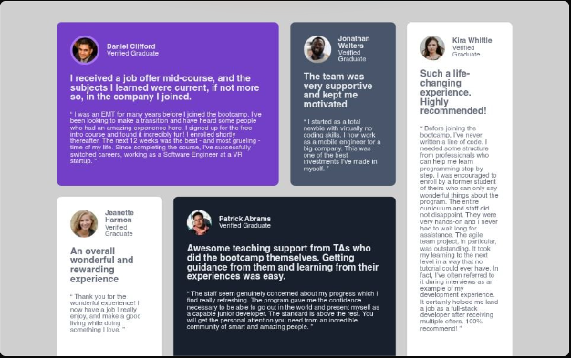

# Frontend Mentor - Testimonials grid section solution

This is a solution to the [Testimonials grid section challenge on Frontend Mentor](https://www.frontendmentor.io/challenges/testimonials-grid-section-Nnw6J7Un7). Frontend Mentor challenges help you improve your coding skills by building realistic projects. 

## Table of contents

- [Overview](#overview)
  - [Screenshot](#screenshot)
  - [Links](#links)
- [My process](#my-process)
  - [Built with](#built-with)
  - [What I learned](#what-i-learned)
- [Author](#author)

## Overview

### Screenshot

### Links

 Live Site URL: [Vercel](https://frontend-testimonialsgrid.vercel.app/)

## My process

### Built with

- Semantic HTML5 markup
- CSS custom properties
- Flexbox
- CSS Grid
- Mobile-first workflow
- SCSS

### What I learned

- Familiarizing with CSS Grid and Flexbox
- CSS BEM (Block Element Modifier) structure attempt
- box-sizing: border-box
- Usage of SCSS
- Mobile-first styling
- Grid usage for cards

## Author

- Frontend Mentor - [@RemiPish](https://www.frontendmentor.io/profile/RemiPish)